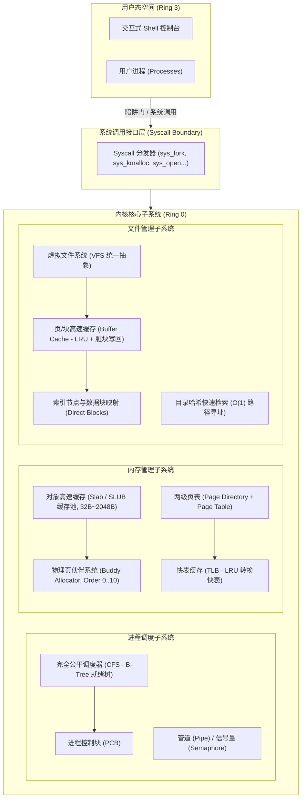

# Mini-OS

项目现在包含两个入口：

- **`baremetal/`：可在 QEMU 中从磁盘启动的 x86_64 原生内核**。使用 `no_std`、UEFI 引导、原生帧缓冲桌面、PIT 硬件时钟和 PS/2 键鼠，不依赖浏览器或宿主操作系统。
- **`src/`：原有宿主机内核机制模拟器**。保留 Buddy/Slab、CFS、VFS、IPC 的算法实现与回归测试；模拟寄存器推进和 Ring0/Ring3 状态不构成硬件执行或用户态隔离。

## 启动原生系统（QEMU）

```powershell
./baremetal/run-qemu.ps1
```

脚本构建 EFI 内核和 64MiB FAT32 启动磁盘，并启动 QEMU。QEMU 需提供 x86_64 UEFI 固件；可通过 `-QemuPath`、`-FirmwarePath` 指定位置。
镜像位于 `target/baremetal/mini-os.img`。原生桌面支持鼠标和 `F1..F5` 切换应用，`A/F` 分配/释放物理页，`N/K` 创建/移除协作式内核任务，`F4` 打开内核终端。

当前原生内核提供基本桌面、真实硬件中断、物理页管理和 RAM 文件；用户态程序、抢占式上下文切换、磁盘持久化与权限隔离尚未迁移。详见 [原生内核说明](baremetal/README.md)。

以下是原有**宿主机模拟器**的架构和运行说明。

---

## 架构概览与子系统设计



---

## 核心功能与性能优化特性

### 1. 内存管理子系统 (Memory Management)
- **物理页伙伴系统 (Buddy Allocator)**:
  - 按 2 的幂次方对齐管理物理页框 (4KB ~ 4MB，Order 0..10)。
  - **位运算优化**: 采用 `buddy_pfn = pfn ^ (1 << order)` 在 $O(1)$ 时间内计算伙伴地址。
  - **碎片消除与安全隔离**: 内存释放时自动向上递归合并空闲伙伴块；内存管理器通过安全切片操作清零新映射的物理页，Buddy 仅管理页号。页号分配/释放历史实测有效吞吐量超过 **1,100 万次/秒**。
- **对象高速缓存分配器 (Slab / SLUB Allocator)**:
  - 针对内核与用户频繁申请的定长微小对象（32B ~ 2048B），直接向伙伴系统申请大页切分对象槽位。
  - **内存节约 98.42%**: 彻底消除小对象直接申请整页（4KB）造成的严重内部碎片。
  - 纯位运算槽位检索，分配/释放综合吞吐量达 **1,400 万次/秒**。
- **多级页表与 TLB 快表 (Page Table & TLB)**:
  - 实现两级树状分页架构，按需映射二级页表，严格执行 32 位虚存边界检查与权限规范化。
  - 模拟硬件 MMU 的 LRU TLB 转换快表，支持 MRU 热路径快速命中，避免频繁的 Page Table Walk。

### 2. 进程与调度子系统 (Process & CFS Scheduler)
- **完全公平调度器 (CFS)**:
  - 参照 Linux CFS 核心调度理念，采用高局部性的 B-Tree 就绪树 (`BTreeSet`) 维护就绪队列。
  - **Linux 40 级 Nice 权重表**: 支持 Nice 值 `-20 ~ +19` 权重映射，通过虚拟运行时间 `vruntime` 纳秒级平滑计费。
  - **$O(\log N)$ 单趟提取与纳秒级调度**: 基于 `pop_first()` 极速挑出最小 `vruntime` 进程，高并发（100 任务）下单次调度决策延迟仅 **~130 ns**，决策吞吐量超 **770 万次/秒**。
  - **Jain 公平性指数达 0.9990 (99.9%)**: 精准按权重分配 CPU 虚拟运行时间。
- **进程控制块 (PCB) 与上下文管理**:
  - 维护通用寄存器（RIP, RSP, RBP, RAX..RDI, RFLAGS）、特权级（Ring 0 / Ring 3）、虚拟内存区域 (VMA) 与独立文件描述符表。
  - 支持安全的事务性 `fork` 回滚与进程退出全局资源完整回收（父子句柄独立引用计数，消除孤儿泄漏）。
- **IPC 原语**:
  - 实现了基于环形缓冲区的匿名管道 (`Pipe`，支持批量读写加速) 与计数信号量 (`Semaphore`)。

### 3. 文件管理子系统 (VFS & Buffer Cache & On-Disk Persistence)
- **虚拟文件系统 (VFS)**:
  - 统一抽象目录、常规文件与设备，支持 POSIX 风格的 `open`, `read`, `write`, `seek`, `close`, `mkdir`, `unlink`, `stat`。
  - **直接块 + 一级间接块索引**: 支持 12 个直接块与 1 个一级间接块 (128 个块指针)，单文件容量支持到 140 块 (70KB)。
  - **100% 磁盘存储零泄露**: 文件截断 (`O_TRUNC`) 或删除 (`unlink`) 时，递归回收直接块与间接索引块至 `free_blocks`，并同步废弃缓存项，避免脏数据残留；遵循 POSIX 语义，已打开文件在最后一个句柄关闭前保持可读。
- **磁盘镜像二进制持久化 (On-Disk Format & Cold Reboot)**:
  - 严格定义超级块 (`DiskSuperblock`, Magic: 0x4D494E49)、Inode 分配位图、数据块分配位图、64B 紧凑 Inode 表 (`DiskInode`) 以及目录项结构。
  - 支持 `format_disk` (mkfs)、`commit_vfs_to_disk` (在临时状态完整构建后提交，失败保持原设备与分配状态) 与 `mount_filesystem` (校验镜像并冷启动恢复)。宿主机导出文件的写入尚不提供断电恢复保证。
  - 统一保留块 0..34；目录支持多个直接块和间接块。当前持久化格式最多 4096 个 512B 块、256 个 inode、单个文件名最多 58 个 UTF-8 字节；少于 36 块的设备仅用于内存模拟，不能提交磁盘格式。
  - 支持将磁盘镜像导出到宿主机真实物理文件 (`save <img_path>`) 及重新装载 (`load <img_path>`)，实现跨生命周期的冷重启持久化。
- **块缓冲与页缓存 (Buffer Cache - Write-Back LRU)**:
  - **核心性能加速**: 避免每次文件读写都触发底层块存储的寻道延迟。
  - 采用稳定节点索引维护 LRU，命中、淘汰与失效时无需扫描整个访问队列；脏块延迟写回，写回失败仍保留缓存数据，零容量直接访问设备。
  - 在底层硬件 I/O 周期仿真模型下（读 500 周期、写 600 周期），削减模拟磁盘 I/O 周期 **78.75%**，模拟周期加速达 **4.71x**。

### 4. 高级虚拟化与内存隔离特性 (Micro-VM & COW Paging)
- **微指令虚拟机与自主程序执行 (Micro-VM Execution Engine)**:
  - 设计 8 字节紧凑机器指令集（`Nop`, `MovImm`, `MovReg`, `AddImm`, `SubImm`, `Jmp`, `Jz`, `Jnz`, `Syscall`, `Halt`）。
  - 实现 Fetch-Decode-Execute 指令周期闭环，配合 `sys_exec` 字节码装载器，支持进程自主运行。成功装载与模拟 burst 任务明确区分，零编码 `Nop` 可以正常执行。
  - 程序上限 64KiB；新地址空间完整装载后才替换旧程序，内存不足完整回滚。代码、数据与栈按页安排，超过 28KiB 的代码不会覆盖固定数据页；短程序仍使用 0x8000 数据页。
  - 自带预置可执行文件 `/bin/hello`，支持父子进程间通过真实管道协同流式交互。
- **写时复制与按需调页 (COW Fork & Demand Paging)**:
  - **物理页引用计数**: `MemoryManager` 维护物理页共享引用计数，进程退出或解除映射时按引用计数精准释放，杜绝 Use-After-Free 与物理页泄漏。
  - **延迟物理拷贝 (COW)**: `fork_process_cow` 在克隆时父子进程共享物理页框，可写页清除写权限并标记 `FLAG_COW`；写操作触发缺页异常（Page Fault），多进程共享时按需分配新页并拷贝，唯一所有者时自动就地升级为可写。
  - **按需零填充调页 (Demand Zero Paging)**: 支持 `map_demand_zero`，预留虚拟地址区间，直至首次读写触发缺页中断才动态向 Buddy 申请零化物理页。

---

## 性能基准评测实测数据 (Release 编译)

下表保留历史单轮测量样例，不作为当前性能保证。当前 `cargo run --release -- --bench` 会预热并报告多轮中位数；调度循环、模拟 CPU 上下文加载和固定 I/O 周期模型分别测量。具体吞吐随机器和负载变化。

| 子系统 | 测试项目 | 实测性能指标 | 理论复杂度 / 优化亮点 |
| :--- | :--- | :--- | :--- |
| **内存 (Buddy)** | 10,000 次变阶页块分配与回收 | **11,312,451 ops/sec** (平均 90 ns 分配 / 73 ns 释放) | 位运算伙伴配对 $O(\log N)$；页号管理基准不包含 RAM 清零 |
| **内存 (Slab)** | 5,000 次 64-byte 小对象分配与回收 | **14,054,814 ops/sec** (平均 88 ns 分配 / 53 ns 释放) | 消除页内碎片，小对象物理页节约 **98.42%** |
| **进程 (CFS)** | 多优先级调度公平性评测 | **Jain's Fairness: 0.9990 (99.90%)** | 纳秒级单调 `min_vruntime` 对齐 |
| **进程 (CFS)** | 100 并发任务高频选核 | **129.74 ns / 次** (770 万次决策/秒) | B-Tree 就绪树 `pop_first()` 单趟提取 $O(\log N)$ |
| **文件 (VFS)** | 4,000 次随机块 I/O 读写 | **缓冲命中率 78.75%，底层周期加速 4.71x** | LRU 页缓存 + 脏块安全延迟写回 (削减 78.75% 周期) |

---

## 快速构建与运行

### 1. 运行自动化全功能演示 (Demo)
```bash
cargo run --release -- --demo
```

### 2. 运行性能基准测试套件 (Benchmark)
```bash
cargo run --release -- --bench
```

### 3. 运行完整自动化测试套件
```bash
cargo test
```

测试覆盖全维度内核机制：
- `tests/kernel_tests.rs`: 核心基础集成测试（CFS、Buddy、Slab、VFS、间接块、系统调用等，15 项）
- `tests/review_regressions.rs`: 系统审查回归探测（22 项）
- `tests/lifecycle_regressions.rs`: 进程生命周期、睡眠、唤醒、资源隔离（14 项）
- `tests/ipc_tests.rs`: 全功能管道阻塞、唤醒、Broken Pipe、EOF 及 Console 描述符（8 项）
- `tests/workload_tests.rs`: 微指令虚拟机循环、系统调用装载与父子管道协同执行（4 项）
- `tests/persistence_tests.rs`: 磁盘镜像二进制布局、断电冷重启、宿主机文件导入导出（5 项）
- `tests/cow_tests.rs`: 写时复制共享、缺页分裂、独占就地升级、内存回收与按需调页（5 项）
- `tests/mmap_tests.rs`: 虚拟内存区域 (VMA)、匿名与文件 mmap/munmap、微指令内存访存（5 项）
- `tests/memory_review_regressions.rs`: COW 回收、装载失败回滚、段布局、上下文、最终 tick、只读 mmap、部分解除映射、流式推进与退出后的资源保护（17 项）
- `tests/persistence_review_regressions.rs`: 元数据保留、目录多块、满盘回滚、镜像校验与 LRU（12 项）
- `tests/ipc_review_regressions.rs`: 跨页坏地址、Demand/COW 内存不足、读取提交与失败资源守恒（10 项）
- `tests/shell_review_regressions.rs`: 失败 exec 及镜像加载句柄、退出后映射一致性（4 项）

当前宿主机默认测试共 121 项，原生组件另有 11 项。CI 配置分别执行宿主机与原生内核的构建、测试、严格 Clippy 和格式检查，并验证原生输入检查脚本。

长时间模拟可使用 `Kernel::step_once` 或 `step_stream` 获取结构化事件，不必累计文本。Shell 的 `run` 仅保存首尾各 5 条记录；`step` 保留完整显示语义。`load` 在存在文件句柄或文件映射时会报忙，关闭引用后可再次加载。管道容量上限 64KiB。

### 4. 启动内核交互式控制台 (Interactive Shell)
```bash
cargo run --release
```

在 Shell 中可以执行常用命令：
```text
mini-os:/$ help
mini-os:/$ status          # 查看 CPU 周期、调度统计、内存与缓存命中率
mini-os:/$ ps              # 查看进程表与 CFS vruntime
mini-os:/$ exec /bin/hello # 装载并执行预置微指令二进制程序
mini-os:/$ ls /etc         # 查看目录
mini-os:/$ cat /etc/motd   # 读取文件内容
mini-os:/$ write /tmp/note.txt Hello world!  # 写入文件
mini-os:/$ sync            # 提交页缓存与元数据到磁盘
mini-os:/$ save disk.img   # 将内核磁盘镜像导出至宿主机文件
mini-os:/$ load disk.img   # 从宿主机文件恢复挂载磁盘镜像
mini-os:/$ meminfo         # 查看 Buddy 各阶空闲块与 Slab 状态
mini-os:/$ bench           # 随时触发性能基准评测
mini-os:/$ exit            # 退出虚拟机
```

---

## 目录结构说明

```
.
├── Cargo.toml
├── README.md
├── src/
│   ├── main.rs            # 内核主入口、参数解析与启动器
│   ├── lib.rs             # 库根接口导出
│   ├── kernel.rs          # 内核总控中枢 (CPU, MM, Sched, VFS 统一协同)
│   ├── shell.rs           # 交互式内核控制台 (REPL CLI 监视器)
│   ├── arch/              # 硬件与体系结构抽象
│   │   ├── cpu.rs         # 寄存器上下文 (Context Switch) 与通用寄存器存取
│   │   ├── instruction.rs # 8 字节微指令体系与程序构建器
│   │   └── timer.rs       # 时钟中断与休眠队列
│   ├── mm/                # 内存管理子系统
│   │   ├── buddy.rs       # 物理页伙伴系统 (Buddy Allocator)
│   │   ├── slab.rs        # 对象高速缓存 (Slab Allocator)
│   │   ├── page_table.rs  # 两级页表、COW 与按需调页缺页异常处理
│   │   └── tlb.rs         # 快表缓存 (TLB)
│   ├── sched/             # 进程与调度子系统
│   │   ├── pcb.rs         # 进程控制块 (PCB) 与统一描述符表
│   │   ├── cfs.rs         # 完全公平调度器 (CFS) 与公平性计算
│   │   └── ipc.rs         # 管道 (EOF / Broken Pipe / 阻塞唤醒) 与信号量
│   ├── fs/                # 文件管理子系统
│   │   ├── block_dev.rs   # 虚拟块存储设备与文件镜像读写
│   │   ├── buffer_cache.rs# LRU 读写缓冲与延迟写回缓存
│   │   ├── disk.rs        # 磁盘镜像二进制布局、超级块与持久化挂载/恢复
│   │   ├── inode.rs       # 索引节点与数据块映射
│   │   ├── dir.rs         # 目录项与哈希索引
│   │   └── vfs.rs         # 统一虚拟文件系统接口
│   ├── syscall/           # 系统调用层
│   │   ├── types.rs       # 系统调用号 (SYS_FORK_COW, SYS_EXEC 等) 与参数包
│   │   └── handler.rs     # 系统调用分发与特权边界
│   └── benchmark/         # 性能基准评测套件
│       ├── mm_bench.rs    # 内存分配吞吐与碎片测试
│       ├── sched_bench.rs # 调度延迟与公平性测试
│       └── fs_bench.rs    # 页缓存与 I/O 加速比测试
└── tests/
    ├── kernel_tests.rs    # 自动化基础集成测试套件
    ├── review_regressions.rs # 接入 docs/reviews 中的检查回归验证
    ├── lifecycle_regressions.rs # 上下文、退出、唤醒及页清零验证
    ├── ipc_tests.rs       # 管道阻塞/唤醒、EOF、引用计数集成测试
    ├── workload_tests.rs  # 微指令自主执行与父子管道协同测试
    ├── persistence_tests.rs # 磁盘持久化、断电冷启动恢复测试
    ├── cow_tests.rs       # 写时复制 (COW) 与按需缺页异常处理专项测试
    └── mmap_tests.rs      # 虚拟内存区域 (VMA) 与 mmap/munmap 及微指令访存测试
```
