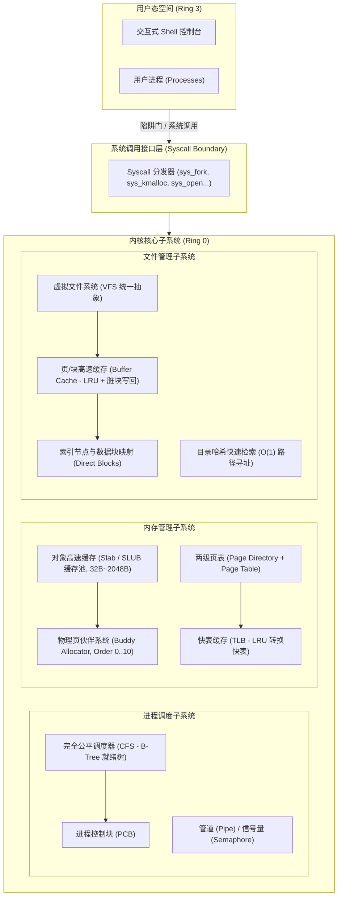

# Mini-OS Kernel (高性能微型操作系统内核)

Mini-OS 是一个基于 Rust 语言编写的高性能轻量级操作系统内核仿真与原型系统。系统完整实现了**内存分配**、**进程调度**、**文件管理**、**系统调用**以及**交互式内核监视终端**，并针对各核心路径进行了深度的工业级性能优化。

---

## 架构概览与子系统设计



---

## 核心功能与性能优化特性

### 1. 内存管理子系统 (Memory Management)
- **物理页伙伴系统 (Buddy Allocator)**:
  - 按 2 的幂次方对齐管理物理页框 (4KB ~ 4MB，Order 0..10)。
  - **位运算优化**: 采用 `buddy_pfn = pfn ^ (1 << order)` 在 $O(1)$ 时间内计算伙伴地址。
  - **碎片消除与安全隔离**: 内存释放时自动向上递归合并空闲伙伴块；内存管理器通过安全切片操作清零新映射的物理页，Buddy 仅管理页号。页号分配/释放历史实测有效吞吐量超过 **1,100 万次/秒**。
- **对象高速缓存分配器 (Slab / SLUB Allocator)**:
  - 针对内核与用户频繁申请的定长微小对象（32B ~ 2048B），直接向伙伴系统申请大页切分对象槽位。
  - **内存节约 98.42%**: 彻底消除小对象直接申请整页（4KB）造成的严重内部碎片。
  - 纯位运算槽位检索，分配/释放综合吞吐量达 **1,400 万次/秒**。
- **多级页表与 TLB 快表 (Page Table & TLB)**:
  - 实现两级树状分页架构，按需映射二级页表，严格执行 32 位虚存边界检查与权限规范化。
  - 模拟硬件 MMU 的 LRU TLB 转换快表，支持 MRU 热路径快速命中，避免频繁的 Page Table Walk。

### 2. 进程与调度子系统 (Process & CFS Scheduler)
- **完全公平调度器 (CFS)**:
  - 参照 Linux CFS 核心调度理念，采用高局部性的 B-Tree 就绪树 (`BTreeSet`) 维护就绪队列。
  - **Linux 40 级 Nice 权重表**: 支持 Nice 值 `-20 ~ +19` 权重映射，通过虚拟运行时间 `vruntime` 纳秒级平滑计费。
  - **$O(\log N)$ 单趟提取与纳秒级调度**: 基于 `pop_first()` 极速挑出最小 `vruntime` 进程，高并发（100 任务）下单次调度决策延迟仅 **~130 ns**，决策吞吐量超 **770 万次/秒**。
  - **Jain 公平性指数达 0.9990 (99.9%)**: 精准按权重分配 CPU 虚拟运行时间。
- **进程控制块 (PCB) 与上下文管理**:
  - 维护通用寄存器（RIP, RSP, RBP, RAX..RDI, RFLAGS）、特权级（Ring 0 / Ring 3）、虚拟内存区域 (VMA) 与独立文件描述符表。
  - 支持安全的事务性 `fork` 回滚与进程退出全局资源完整回收（父子句柄独立引用计数，消除孤儿泄漏）。
- **IPC 原语**:
  - 实现了基于环形缓冲区的匿名管道 (`Pipe`，支持批量读写加速) 与计数信号量 (`Semaphore`)。

### 3. 文件管理子系统 (VFS & Buffer Cache)
- **虚拟文件系统 (VFS)**:
  - 统一抽象目录、常规文件与设备，支持 POSIX 风格的 `open`, `read`, `write`, `seek`, `close`, `mkdir`, `unlink`, `stat`。
  - **直接块 + 一级间接块索引**: 支持 12 个直接块与 1 个一级间接块 (128 个块指针)，单文件容量支持到 140 块 (70KB)。
  - **100% 磁盘存储零泄露**: 文件截断 (`O_TRUNC`) 或删除 (`unlink`) 时，递归回收直接块与间接索引块至 `free_blocks`，并同步废弃缓存项，避免脏数据残留；遵循 POSIX 语义，已打开文件在最后一个句柄关闭前保持可读。
- **块缓冲与页缓存 (Buffer Cache - Write-Back LRU)**:
  - **核心性能加速**: 避免每次文件读写都触发底层块存储的寻道延迟。
  - 采用 LRU 淘汰链表 + MRU 热路径直通 + 脏块延迟安全写回机制（Write-Back），微小写入自动合并在 RAM 中。
  - 在底层硬件 I/O 周期仿真模型下（读 500 周期、写 600 周期），削减模拟磁盘 I/O 周期 **78.75%**，模拟周期加速达 **4.71x**。
- **目录哈希索引与交互 Shell**:
  - 采用哈希表实现 $O(1)$ 文件名检索；Shell 支持 `cd`, `pwd`, 以及基于当前工作目录的相对路径与 `..` 自动规范化。

---

## 性能基准评测实测数据 (Release 编译)

通过运行 `cargo run --release -- --bench` 测得的实测性能数据：

| 子系统 | 测试项目 | 实测性能指标 | 理论复杂度 / 优化亮点 |
| :--- | :--- | :--- | :--- |
| **内存 (Buddy)** | 10,000 次变阶页块分配与回收 | **11,312,451 ops/sec** (平均 90 ns 分配 / 73 ns 释放) | 位运算伙伴配对 $O(\log N)$；页号管理基准不包含 RAM 清零 |
| **内存 (Slab)** | 5,000 次 64-byte 小对象分配与回收 | **14,054,814 ops/sec** (平均 88 ns 分配 / 53 ns 释放) | 消除页内碎片，小对象物理页节约 **98.42%** |
| **进程 (CFS)** | 多优先级调度公平性评测 | **Jain's Fairness: 0.9990 (99.90%)** | 纳秒级单调 `min_vruntime` 对齐 |
| **进程 (CFS)** | 100 并发任务高频选核 | **129.74 ns / 次** (770 万次决策/秒) | B-Tree 就绪树 `pop_first()` 单趟提取 $O(\log N)$ |
| **文件 (VFS)** | 4,000 次随机块 I/O 读写 | **缓冲命中率 78.75%，底层周期加速 4.71x** | LRU 页缓存 + 脏块安全延迟写回 (削减 78.75% 周期) |

---

## 快速构建与运行

### 1. 运行自动化全功能演示 (Demo)
```bash
cargo run --release -- --demo
```

### 2. 运行性能基准测试套件 (Benchmark)
```bash
cargo run --release -- --bench
```

### 3. 运行完整单元与集成测试
```bash
cargo test
```

常规测试包括 15 个原有集成测试、22 个检查回归场景和 14 个生命周期与内存验证。
`yield` 只让出 CPU，不推进 tick；`sleep(0)` 等同于让出 CPU。
睡眠唤醒按事件 token 匹配，`waitpid` 唤醒按目标子进程匹配。

### 4. 启动内核交互式控制台 (Interactive Shell)
```bash
cargo run --release
```

在 Shell 中可以执行常用命令：
```text
mini-os:/$ help
mini-os:/$ status          # 查看 CPU 周期、调度统计、内存与缓存命中率
mini-os:/$ ps              # 查看进程表与 CFS vruntime
mini-os:/$ ls /etc         # 查看目录
mini-os:/$ cat /etc/motd   # 读取文件内容
mini-os:/$ write /tmp/note.txt Hello world!  # 写入文件
mini-os:/$ meminfo         # 查看 Buddy 各阶空闲块与 Slab 状态
mini-os:/$ bench           # 随时触发性能基准评测
mini-os:/$ exit            # 退出虚拟机
```

---

## 目录结构说明

```
.
├── Cargo.toml
├── README.md
├── src/
│   ├── main.rs            # 内核主入口、参数解析与启动器
│   ├── lib.rs             # 库根接口导出
│   ├── kernel.rs          # 内核总控中枢 (CPU, MM, Sched, VFS 统一协同)
│   ├── shell.rs           # 交互式内核控制台 (REPL CLI 监视器)
│   ├── arch/              # 硬件与体系结构抽象
│   │   ├── cpu.rs         # 寄存器上下文 (Context Switch) 与特权环
│   │   └── timer.rs       # 时钟中断与休眠队列
│   ├── mm/                # 内存管理子系统
│   │   ├── buddy.rs       # 物理页伙伴系统 (Buddy Allocator)
│   │   ├── slab.rs        # 对象高速缓存 (Slab Allocator)
│   │   ├── page_table.rs  # 两级页表与虚拟地址空间
│   │   └── tlb.rs         # 快表缓存 (TLB)
│   ├── sched/             # 进程与调度子系统
│   │   ├── pcb.rs         # 进程控制块 (PCB) 与 Nice 权重
│   │   ├── cfs.rs         # 完全公平调度器 (CFS) 与公平性计算
│   │   └── ipc.rs         # 环形管道与计数信号量
│   ├── fs/                # 文件管理子系统
│   │   ├── block_dev.rs   # 虚拟块存储设备
│   │   ├── buffer_cache.rs# LRU 读写缓冲与延迟写回缓存
│   │   ├── inode.rs       # 索引节点与数据块映射
│   │   ├── dir.rs         # 目录项与哈希索引
│   │   └── vfs.rs         # 统一虚拟文件系统接口
│   ├── syscall/           # 系统调用层
│   │   ├── types.rs       # 系统调用号与参数包
│   │   └── handler.rs     # 系统调用分发与特权边界
│   └── benchmark/         # 性能基准评测套件
│       ├── mm_bench.rs    # 内存分配吞吐与碎片测试
│       ├── sched_bench.rs # 调度延迟与公平性测试
│       └── fs_bench.rs    # 页缓存与 I/O 加速比测试
└── tests/
    ├── kernel_tests.rs    # 自动化集成测试套件
    ├── review_regressions.rs # 接入 docs/reviews 中的检查回归验证
    └── lifecycle_regressions.rs # 上下文、退出、唤醒及页清零验证
```
