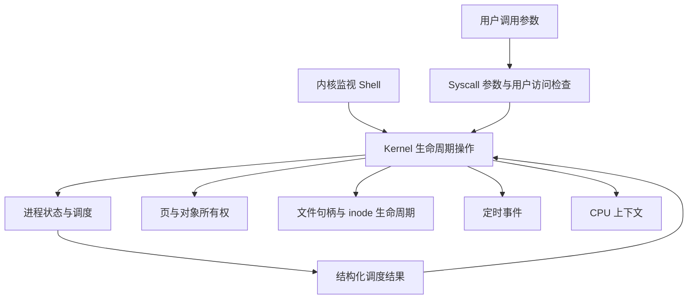

# System 架构与实现检查

检查日期：2026-10-07。范围：System 当前工作目录的全部 Rust 模块、集成测试和 README；检查的是现有实现，不是某次提交的差异。检查结束时 HEAD 为 `d24dda7`，已有源文件没有未提交改动。

## 结论

目录按 arch、mm、sched、fs、syscall 划分清楚，Buddy 的分配追踪、结构化调度事件、跨页访问权限检查，以及直接/间接块回收都是值得保留的基础。当前最需要改善的是资源所有权和跨模块生命周期协作。仅增加缓存或替换容器，无法解决已经复现的页框重复分配、退出资源泄漏和阻塞无法恢复。

建议优先修复下面的 P1 问题，再缩小公开接口，最后用可信的基准判断性能改动。当前系统适合作为宿主机上的内核机制模拟器；文档中的性能和特权隔离表述应明确这一范围。

## 验证结果

| 检查 | 结果 |
| --- | --- |
| `cargo test --all-targets --offline` | 原有 15 个集成测试全部通过；lib/bin 没有单元测试 |
| 独立边界验证 | 19 个场景，1 个通过、18 个失败；失败场景按预期行为编写，揭示现有遗漏，并非原有测试回归 |
| `cargo clippy --all-targets --offline -- -D warnings` | 未通过，lib 报告 16 项诊断，主要是 Default、嵌套条件和冗余转换；尚不能据此确认全部目标均已检查完 |
| `cargo run --release --offline -- --bench` | 完成；模拟 I/O 周期加速 4.71x，宿主机实际耗时为直接访问 724.80µs、缓存访问约 1.36ms |

性能数字来自一次运行，不代表稳定性能结论。编译器为 rustc 1.98.1。检查没有修改已有源文件；新增本报告、独立验证源码和验证输出。

验证文件：[system-review-probes.rs](C:/Users/Flowsink/Documents/GitHub/System/docs/reviews/system-review-probes.rs)；[完整输出](C:/Users/Flowsink/Documents/GitHub/System/docs/reviews/system-review-probes-output.txt)。文件放在 docs 下，不会被普通 cargo test 自动运行。

## P1：应先处理的实现问题

### 1. Slab 归还物理页后仍可分配该页

位置：[SlabCache::free](C:/Users/Flowsink/Documents/GitHub/System/src/mm/slab.rs:118)。

空 Slab 在存在多个 Slab 时调用 buddy.free_pages，但没有移除 slabs、pfn_map、partial_slabs 中对应项。下一次 Slab 分配仍能从已经归还的页取槽位。

复现：2 个物理页，分配 3 个 2048B 对象；释放第一个页上的两个对象，让 Buddy 重新分配该页，再从 Slab 分配对象。两者拿到同一个 PFN 0，形成重复所有权。原有 Slab 测试只分配 50 个 64B 对象，不跨页，未覆盖这一分支。

建议：归还页和清理索引必须作为一个完整操作。可采用稳定的 Slab ID 和空位表，或移除 Slab 并修正所有移动项索引。短期也可保留空页用于缓存，但必须继续由 Slab 持有，不能同时还给 Buddy。释放失败不能被忽略。

### 2. 退出流程分散，清理、出队和父进程唤醒不一致

位置：[Kernel::terminate_process](C:/Users/Flowsink/Documents/GitHub/System/src/kernel.rs:110)、[ProcessManager::kill](C:/Users/Flowsink/Documents/GitHub/System/src/sched/mod.rs:199)、[调度完成分支](C:/Users/Flowsink/Documents/GitHub/System/src/sched/mod.rs:174)、[SYS_EXIT](C:/Users/Flowsink/Documents/GitHub/System/src/syscall/handler.rs:28)、[Shell kill](C:/Users/Flowsink/Documents/GitHub/System/src/shell.rs:204)。

已复现四种不一致：

- Shell 所用的 pm.kill 只改状态和出队；随后 waitpid 移除 PCB，子进程物理页仍未归还。父子各占 2 页，回收子进程后仍占 4 页，预期 2 页。
- burst 自然完成只标记 Terminated，地址空间仍占 2 页。
- Kernel::terminate_process 清理地址空间并改 Zombie，却没有从就绪队列移除 PID；已退出进程仍能被 pick_next_task 选中。
- waitpid 阻塞父进程后，子进程通过 SYS_EXIT 退出，没有唤醒父进程。

建议：让 Kernel 统一拥有完整退出操作，包含出队、清理页/FD/进程分配、取消等待、保存退出码和唤醒等待者。Shell、SYS_EXIT、自然完成都走同一条路径。ProcessManager 负责状态和调度，不自行绕过资源清理；waitpid 仅回收已完成清理的 Zombie。自然完成时由结构化事件通知 Kernel，避免 sched 依赖 fs/mm。

### 3. fork 失败缺少事务回滚

位置：[Kernel::fork_process](C:/Users/Flowsink/Documents/GitHub/System/src/kernel.rs:99)、[SYS_FORK](C:/Users/Flowsink/Documents/GitHub/System/src/syscall/handler.rs:41)、[AddressSpace::fork_clone](C:/Users/Flowsink/Documents/GitHub/System/src/mm/page_table.rs:234)。

先建立并入队子 PCB，再逐页克隆地址空间；中途内存不足直接返回 Err。已分配的子页没有归还，子 PCB 也没有撤销。

复现：总内存 3 页，init 占 2 页，fork 克隆第二页时失败。进程数/空闲页从 `(1, 1)` 变为 `(2, 0)`，调用虽失败却留下子进程和泄漏页。

建议：先构建尚未发布的子地址空间和资源，成功后再插入 PCB、加入就绪队列；失败时销毁部分地址空间并撤销已增加的资源引用。用显式分配事务或能访问资源管理器的守卫完成回滚，不能指望普通 Vec/Box 的 Drop 自动归还模拟 Buddy 页。

### 4. fork 的 FD 继承会关闭父进程句柄，并覆盖已有 FD

位置：[fork_pcb](C:/Users/Flowsink/Documents/GitHub/System/src/sched/mod.rs:86)、[PCB FD 分配](C:/Users/Flowsink/Documents/GitHub/System/src/sched/pcb.rs:126)、[VFS close](C:/Users/Flowsink/Documents/GitHub/System/src/fs/vfs.rs:272)。

fd_table.clone 复制的是相同的全局 vfs_fd，VFS 没有引用计数；子进程 close 或 exit 删除全局打开文件，父进程随即无法使用。子 PCB 的 next_fd 又重新从 3 开始，首次 open 覆盖继承的 FD 3。这两种情形都已复现。

建议：分清进程局部 FD、共享的打开文件描述对象、inode 三种生命周期。fork 增加打开文件对象的引用，保留共享偏移语义，close 只递减一个引用；最后一个引用释放对象。FD 分配应搜索空槽或正确继承分配状态。

### 5. SYS_SLEEP 没有注册唤醒时间

位置：[SYS_SLEEP](C:/Users/Flowsink/Documents/GitHub/System/src/syscall/handler.rs:160)、[VirtualTimer::add_sleep](C:/Users/Flowsink/Documents/GitHub/System/src/arch/timer.rs:58)。

处理器只调用 pm.block，忽略 arg0，且分发接口根本不接受 Timer。睡眠 2 ticks 后推进 5 ticks，进程仍阻塞。

建议：由 Kernel::sleep_current 同时注册定时事件和改变进程状态，保证只有一个入口维护这组约束。定义 sleep(0)、退出后定时事件和重复睡眠的行为；唤醒需要匹配当前等待原因/事件，避免旧事件唤醒新的等待。

### 6. 地址空间隔离存在三个漏洞

位置：[PageDirectory::walk](C:/Users/Flowsink/Documents/GitHub/System/src/mm/page_table.rs:116)、[allocate_and_map](C:/Users/Flowsink/Documents/GitHub/System/src/mm/page_table.rs:189)。

- 两级页表仅支持 32 位地址，却接收 usize 并屏蔽高位；64 位宿主机上 `0x1_0000_1000` 可访问 `0x1000` 的页。建议明确地址宽度，在转换、映射和解除映射入口统一校验，而不是默默截断。
- 归还页后再次给新地址空间分配时没有清零；仅 1 页的测试中，新进程读到旧进程的 `SECRET`。建议由 MemoryManager 负责用户页分配和清零，页表只负责映射。不要让调用者各自记住清零步骤。
- map_page 自动补 FLAG_PRESENT，但 TLB 插入原始 flags。使用 `FLAG_WRITABLE | FLAG_USER` 映射时，热 TLB 返回页不存在，flush 后的页表遍历却成功。建议只产生一份规范化映射记录，页表和 TLB 使用相同权限值。

### 7. 系统调用的缓冲区与错误语义不完整

位置：[SYS_READ](C:/Users/Flowsink/Documents/GitHub/System/src/syscall/handler.rs:99)、[SYS_WRITE](C:/Users/Flowsink/Documents/GitHub/System/src/syscall/handler.rs:122)、[init 数据页](C:/Users/Flowsink/Documents/GitHub/System/src/kernel.rs:94)。

已复现：读取时先推进文件偏移，再向用户空间复制；错误地址导致调用返回 Err，却已经消耗 2 字节。`write(fd, 0, 0)` 返回 21，并写入默认文本，而不是返回 0。

代码还显示：用户提供的长度直接用于 vec 分配，没有上限或可失败分配；open 超过 256B 的路径被静默截断；init 数据页 flags=0x3 不带 FLAG_USER，不能作为用户态读写缓冲区。

建议：引入集中的 UserBuffer 检查与分块复制逻辑，先验证本次目标范围、再读取并提交偏移；明确跨页中途失败的部分成功语义。零长度返回 0，空指针在需要访问时返回错误。演示默认值移到 Demo。对长度、地址加法和文件最大偏移做检查，避免大长度直接触发宿主机内存耗尽。

### 8. VFS 对目录删除和打开文件生命周期处理不完整

位置：[VFS unlink](C:/Users/Flowsink/Documents/GitHub/System/src/fs/vfs.rs:278)、[Directory::remove_entry](C:/Users/Flowsink/Documents/GitHub/System/src/fs/dir.rs:69)、[VFS write](C:/Users/Flowsink/Documents/GitHub/System/src/fs/vfs.rs:235)。

已复现：

- `unlink("/dir/.")`：remove_entry 拒绝删除 `.`，调用者忽略返回值，却继续销毁 inode，根目录留下指向不存在 inode 的项。
- 打开的文件 unlink 后立即删除 inode、释放数据块；旧 FD 的 read 返回 Inode not found。若保持 README 的 POSIX 风格承诺，应延迟到最后一个打开引用释放时再回收。
- 目录可以按 O_RDWR 打开并写入普通文件数据，目录 inode 获得数据块与 size，与目录项表示脱节。

建议：先拒绝对 `.`、`..` 和根 inode 的删除；每一步验证成功后再提交后续修改。对 inode 类型集中检查，常规文件读写拒绝目录。维护链接数与打开引用数；若刻意简化 unlink 语义，应写明规则，并至少在文件打开时拒绝删除。

### 9. 启动时 CPU 没有加载 init 上下文

位置：[bootstrap_processes](C:/Users/Flowsink/Documents/GitHub/System/src/kernel.rs:83)、[schedule_step](C:/Users/Flowsink/Documents/GitHub/System/src/sched/mod.rs:155)、[Kernel::step](C:/Users/Flowsink/Documents/GitHub/System/src/kernel.rs:155)。

启动直接设置 current_pid，但 CPU 仍是默认上下文。第一次调度选中同一个 PID，被判断为没有切换，随后将默认 CPU 上下文写回 PCB。复现中首 tick 的 RIP 是 40，预期从 0x1000 推进到 4136。

建议：启动保持未运行状态，第一次调度正式加载 PCB；或者启动时同步设置 CPU/PCB/调度器三方状态。调度结果需区分“选中任务”和“CPU 是否已经加载该任务”，不能仅依赖 PID 是否变化。SYS_YIELD 也应通过 Kernel 统一提交调度结果，避免只改变 PM、遗漏 CPU。

## 架构调整：沿真实协作关系收拢职责

### A. 让 Kernel 成为跨子系统操作的唯一协调入口

目前 Kernel、SyscallDispatcher、Shell 都能直接操纵 PCB、Buddy、VFS。相同业务在多个入口重复，正是退出/fork/sleep 不一致的原因。

建议 Shell 作为内核监视器调用 Kernel 的命令接口，syscall 模块负责参数解码和用户访问检查，再调用同一组操作。Kernel 统一协调，但将细节委托给 MM/进程/VFS 各模块，避免把全部算法堆进 kernel.rs。



### B. 缩小接口，把约束留在模块内部

Kernel、ProcessManager、MemoryManager、AddressSpace、VFS 大量内部字段公开，调用者可以绕过 TLB 失效、队列维护和资源回收。将可变内部状态逐步改成私有，提供查询快照与维护约束的操作。

例如 MM 对外提供 allocate_user_page、map/unmap、kmalloc/kfree，不要求 Shell/Kernel 同时理解 slab 和 buddy 的可变借用；VFS 隐藏 free_blocks 和 open_files，外部只能持有类型明确的句柄。采用 Pid、UserFd、OpenFileId、Pfn 等新类型，减少不同编号空间都用 usize 引起的误用。

不必为每个模块新增 trait。等到需要真实存储或可注入故障的存储实现时，再为块设备设置一个小接口，统一传递 I/O 错误。重点是约束集中维护和接口可测试性。

### C. 统一错误和初始化规则

当前大量 `let _ = ...` 忽略清理和引导错误，new 返回看似成功的 Kernel；极小内存或磁盘也会得到不完整状态。建议 KernelConfig + try_new，校验页数、缓存容量、时钟周期和必要资源。

用 KernelError/MmError/FsError 表达 NoSpace、BadFd、BadAddress、PermissionDenied、InvalidState 等类别，字符串只用于展示。先覆盖对调用者处理方式有影响的错误，避免为每一句错误文本建立一个变体。

### D. 保留结构化事件，格式化移出运行循环

ProcessManager 已返回 ScheduleEvent，是好的设计。Kernel::step 却仍逐 tick 分配 String 并累计 Vec<String>。建议增加不格式化的 step_once，返回结构化事件/执行结果；Shell/Demo 决定是否记录和显示。长期运行可使用事件回调或有界日志，避免 tick 数和内存消耗线性增长。

## P2/P3：后续优化与工程维护

| 项目 | 证据与建议 |
| --- | --- |
| fork 的 TLB 容量错误 | page_table.rs:239 使用 `self.tlb.hits + 64` 作为容量。访问越久，子进程 TLB 越大；应复制配置容量，而非运行统计。 |
| LRU 热路径线性扫描 | buffer_cache.rs:121、tlb.rs:38 都包含扫描/中间删除，成本随容量增加。BufferCache 可考虑 HashMap + 稳定节点索引 + 双向链；小 TLB 的连续数组可能更快，需比较 16/64/256 等容量后决定。 |
| 完整块写入可减少复制 | inode.rs:194 对整块覆盖仍先读再改写。完整块直接写入；部分块保留读改写。 |
| 大洞和大偏移 | inode.rs:169 对 hole_len 一次分配等长 Vec，seek 允许任意 usize。先检查最大文件长度和溢出，使用固定大小零块填充。 |
| 写回失败保留脏数据 | buffer_cache.rs:129 先从缓存删除脏块，再执行可能失败的写回。应写回成功后才移除；目前虚拟设备主要以越界报错，接入真实/故障设备前必须完善此约束。 |
| 统计语义一致 | scheduler.context_switches 统计取任务次数；单进程重新选中也计数。sched_bench 用总循环耗时除以此值，不能称为真实上下文切换耗时。list_dir 的 blocks_used 又只算直接块，与 stat 不同。 |
| 入口模块重复 | main.rs 与 lib.rs 重复声明同一套 pub mod，形成 bin/lib 两套模块编译。main.rs 直接导入 mini_os_kernel 库即可；benchmark/监视 CLI 可逐步移到示例或独立入口。 |
| Shell 完整性 | shell.rs:69 未处理 read_line 返回 Ok(0)，EOF 后可能反复输出提示；cat 一次最多读取 4096B，超过此长度截断。 |
| 尚未完成的接口 | SYS_STAT/SYS_MKDIR 定义但没有分发；SYS_PIPE 仅创建 Pipe ID，没有接入进程 FD/read/write/阻塞唤醒；标准 FD 0/1/2 也没有对应 VFS 对象。应补齐端到端语义或明确未支持项。 |
| 质量门槛 | 清理 Clippy 诊断，建立基本 CI：构建、现有测试、关键生命周期回归、Clippy；格式检查建议单独引入，不混入机制修复。 |

## 性能结论与 README 修正

1. BTreeSet 是 B-tree 集合，不是红黑树；取出最小元素还包含删除维护，不能把 pick_next_task 整体宣称为 O(1)。可以继续使用现有容器，先修正文档。
2. 4.71x 是读操作固定计 500 周期、写操作固定计 600 周期得到的模型收益，不是宿主机实际吞吐提升。本次实际缓存耗时更高，说明模型和宿主机性能必须分别报告。
3. Slab 内存节约 98.42% 是按页/槽位公式计算，不含 HashMap、Vec、页表等宿主机元数据，不能等同整个程序 RSS 节约。
4. 调度公平性在现有三任务/1000 tick 场景达到 0.9990，但不能说明 sleep、wake、fork、退出后的公平性或无饥饿。独立验证中单任务运行后的 min_vruntime 推进通过，未将其当作确认缺陷。
5. 性能评测应添加预热、多轮统计、工作负载/容量变化和正确性校验；分开测分配/释放、纯调度决策、CPU 模拟切换、文件系统端到端，以及缓存簿记开销。普通微基准不需要复杂框架才能起步。

## 建议实施顺序

1. 修复 Slab 页所有权、fork 回滚、地址空间隔离与目录 `.` 删除；用守恒和隔离测试保护这些约束。
2. 统一退出/睡眠/fork 协作入口，修复共享 FD、父进程唤醒和初始 CPU 上下文。
3. 完善 syscall 的用户缓冲区、长度/零长度/错误规则和文件生命周期，再缩小字段可见性。
4. 修正文档和指标口径，建立质量检查后，再依据多轮数据优化缓存和复制。

回归重点应是：物理页/磁盘块守恒、失败操作无残留、就绪队列只含 Ready 任务、父子句柄互不误关闭、所有阻塞存在解除路径、TLB 与页表权限一致。对 fork 每个分配点注入失败，并测试跨多个 Slab 的反复分配/释放，比增加只检查单次成功的测试更有价值。

## 重跑独立验证

在 System 目录用 PowerShell 执行：

```powershell
cargo build --lib --offline
New-Item -ItemType Directory -Path target/architecture-review -Force | Out-Null
$reviewLibrary = (Get-ChildItem target/debug/deps -Filter 'libmini_os_kernel*.rlib' |
    Sort-Object LastWriteTime -Descending | Select-Object -First 1).FullName
rustc --edition=2024 --test docs/reviews/system-review-probes.rs `
    --extern "mini_os_kernel=$reviewLibrary" -L dependency=target/debug/deps `
    -o target/architecture-review/regressions.exe
if ($LASTEXITCODE -eq 0) {
    & ./target/architecture-review/regressions.exe --test-threads=1 --color never
}
```

这些验证需要根据后续确认的接口契约调整；例如 VFS 若在 open 阶段就拒绝目录写模式，对应测试应允许更早报错。它们是检查证据和回归候选，不是已整合进项目的最终测试套件。

